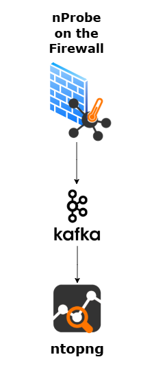

# General Info
This project is focused on creation of a Cybersecurity Attacks Dataset which can later be used for IDS/IPS systems, ML or any other relevant purpose.

The idea is to have an isolated environment with intentionally vulnerable VM's and volunteer attackers who will conduct the attacks. 

In the following sections there is information on the different aspects of this project, and all of that is for the purpose of constructing a Methodology for the entire process.

`Prof note` - sections including what my Professors mentioned to take in mind
`Here we would have` - sections including plan/ideas of what we are going to do / should do regarding that aspect 
# Scenario

#### Prof note
 - VM
 - Container Images
 - CVE
#### Here we would have:
- Metasploitable 2 VMs
- Metasploitable 3 VMs
	- Ubuntu VMs
		- Check if attacks on the Ubuntu VM are possible
	- Windows VMs
		- All attacks are performed on the Windows VM
- SecGen Custom VMs - Still testing if possible
- VulHub Docker Containers inside VMs
#### To think about
- Should we provide the attackers with Kali VMs or should they bring their own?
	- If we provide them, we can preconfigure the VMs with the required tools, NTP config, etc.

# Monitoring

#### Prof note
- Netflow
- Syslog
- Raw Packet Capture
- NTP (synchronize timestamps)

#### Here we would have:

##### RAW Packet Capture
- Still to be tested by Bidik's proposal - Waiting on it
##### NTP
- NTP Syncing will be done by configuring `ntp.finki.ukim.mk` as NTP server on all machines 
- For Linux based, in **systemd** 
	- `/etc/systemd/timesyncd.conf`
- *For older Linux distros, manual installation of NTP server*
- For Windows based, in **Windows Time Service (W32Time)**
##### Logs
- [VictoriaLogs](https://github.com/VictoriaMetrics/VictoriaLogs)
	- All the system logs are stored here
	- Pulling logs from the Kafka queue

- Log Agent on the machine
	- Collect logs from the machine and send them to Kafka
	- Possible agents:
		- [Grafana Promtail](https://grafana.com/grafana/dashboards/20881-promtail-monitoring-metrics-and-logs/)
		- [fluentbit](https://fluentbit.io/)

- [Kafka](https://kafka.apache.org/)
	- receiving and queuing logs from the log agent of each machine

- Deployment scheme:
		
##### NetFlow

- [nprobe](https://www.ntop.org/products/netflow-probes/nprobe/) - NetFlow probe (on the firewall)

- [ntopng](https://www.ntop.org/products/traffic-analysis/ntopng/) - NetFlow web interface

- [kafka](https://kafka.apache.org/)
	- optional: receiving and queuing NetFlow packets from the NetFlow probe (nProbe on the firewall)

- Deployment scheme:
	
# Attacks

#### Prof note
 - List of attacks + variations
 - Procedure for conducting each attack
#### Here we would have:
- Done in separate markdowns in `/Exploits` - Work in progress

# Timing

#### Prof note
 - How many days
 - Schedule of attack
 - Which should be conducted in parallel
 - Which should be conducted non-parallel (alone)
#### Here we would have:
- Will leave it for after the 'Attacks' section.
# Benign Traffic - To discuss - Not relevant right now

# Automatic Labeling

#### Prof note
- What should each attacker keep track of, how, and where?
#### Here we would have:
- Each attacker should keep track of each action/step they take during the attack
- We should have clear timestamps (from - to)
- We should have clear note on which attack it is in the given timestamp
- We should have clear note on source IP and source port(s), destination IP and destination port(s)
- Attackers will be provided with VPN access to the controlled environment with each getting a static IP address, still they should state the source IP for each attack
- Each attacker will be assigned multiple attacks/exploits by random
- For each attack, the attackers will be given markdown file with step-by-step instructions on how to perform the attack
- For each attack, the attackers will be given an intentionally vulnerable VM IP address and port 
	- Have in mind that a single VM can be used by many attackers and for exploiting many vulnerabilities (the exact deployment, number of machines and variants are not discussed in this section and will be defined later - not relevant for now)
##### What is really important: What should each attacker keep track of, how, and where, in order for us to be easier later to conduct automatic labelling of the flows and raw packets using scripts

##### Ideas
- Provide attackers with preconfigured Kali VMs
- Create a CLI tool that will be used for automatically take metrics on attack start/end
- Maybe use Kafka integration for the CLI tool to automatically send the recorded attack data